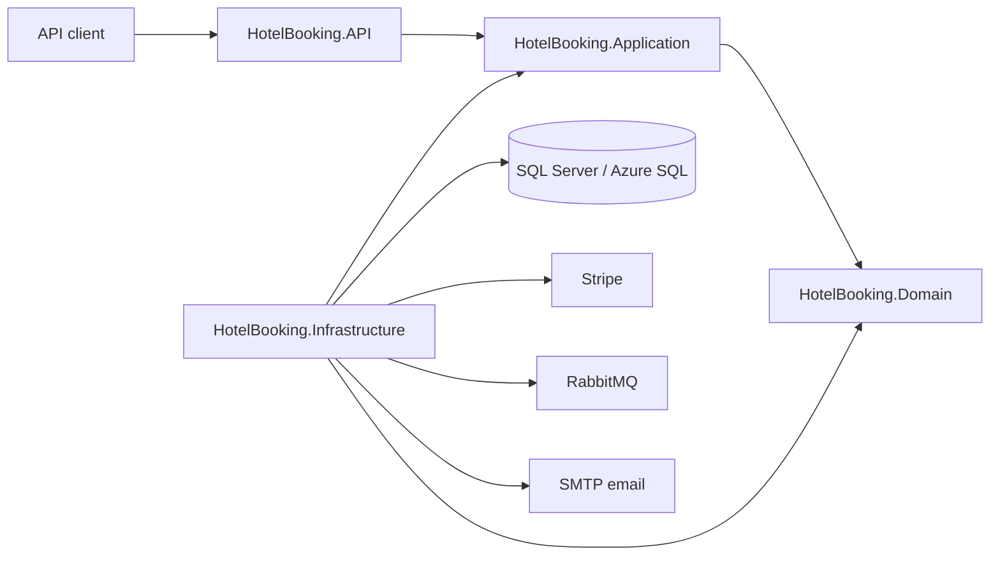
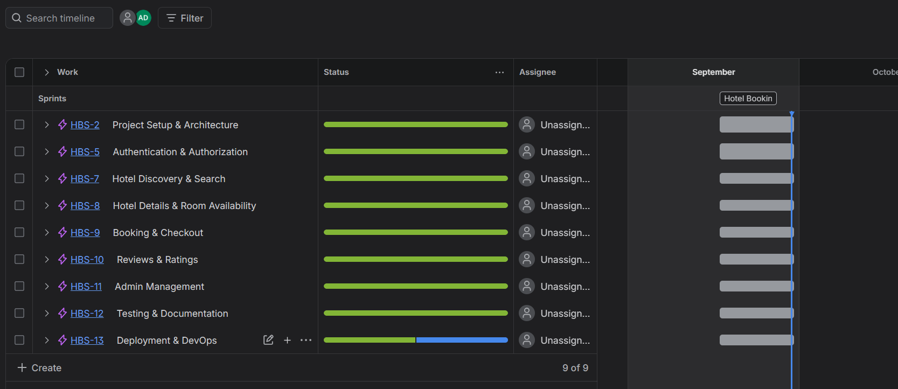
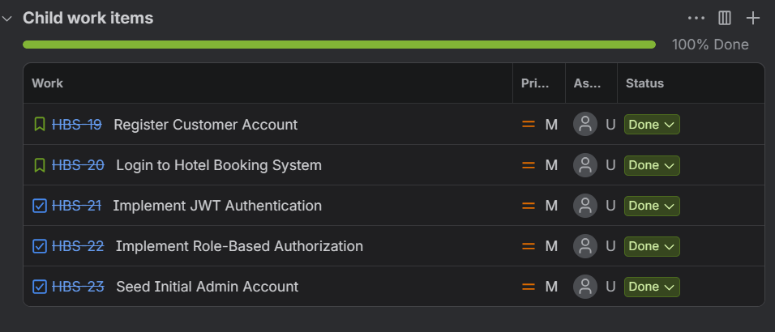
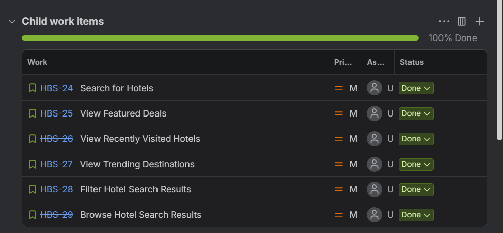
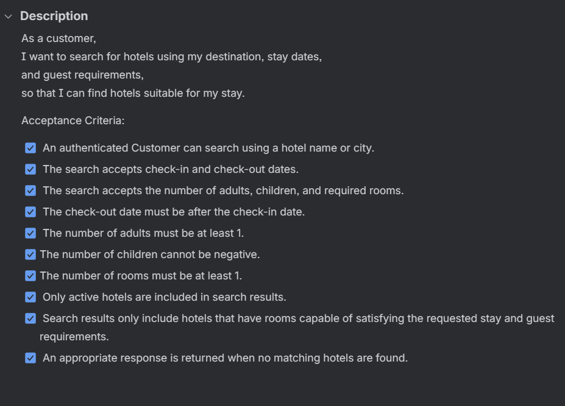

# Hotel Booking System

[](https://github.com/alaa-dere/Travel-and-Accommodation-Booking-Platform/actions/workflows/ci.yml)

An ASP.NET Core Web API for hotel discovery and booking. The solution includes
authentication, hotel and room administration, search, promotions, carts,
checkout, invoices, reviews, nearby attractions, and customer recommendations.

## Live deployment

- **Production API:** [https://hotelbooking-alaa-2026.uaenorth.cloudapp.azure.com](https://hotelbooking-alaa-2026.uaenorth.cloudapp.azure.com)
- **API reference:** [docs/API.md](docs/API.md)
- **CI status:** shown by the GitHub Actions badge above
- **Performance results:** [performance-tests/RESULTS.md](performance-tests/RESULTS.md)

The root endpoint is a public deployment check and returns:

```json
{
  "service": "Hotel Booking API",
  "status": "Running"
}
```

The deployed application runs in `Production`, so Swagger UI is intentionally
disabled on the public server. The complete endpoint contract, roles, request
formats, responses, and error behavior are documented in
[docs/API.md](docs/API.md). Swagger remains available when the project is run
locally in `Development`.

## Evaluation guide

A reviewer can assess the project in this order:

1. Open the [live API](https://hotelbooking-alaa-2026.uaenorth.cloudapp.azure.com)
   to verify that the HTTPS deployment is running.
2. Review [the API reference](docs/API.md) for endpoints and authorization
   rules.
3. Inspect the GitHub Actions result for the Release build, automated tests,
   and Docker image builds.
4. Review the documented [performance results](performance-tests/RESULTS.md),
   including the limitations of the test environment.
5. Review the [architecture decisions](docs/architecture/decisions) for the
   reasoning behind checkout, payment, expiration, messaging, and refund rules.
6. Run the complete local environment with Docker Compose by following the
   instructions below.

## Main features

- Customer registration, login, JWT authentication, and role-based access
  control for `Customer` and `Admin` users.
- Hotel search with dates, guest and room counts, pricing, ratings, amenities,
  hotel type, room type, and paginated results.
- Featured deals, recently visited hotels, and trending destinations.
- Hotel details, galleries, rooms, date-based availability, reviews, geographic
  location, and nearby attractions.
- A single-hotel cart and checkout flow with concurrency-safe availability
  checks and expiring pending bookings.
- Stripe Payment Intents, signed webhooks, idempotent payment handling, and
  refunds for eligible cancellations.
- Invoices, confirmation PDFs, and asynchronous confirmation email delivery.
- RabbitMQ consumers with retries and dead-letter queues for background work.
- Admin management for cities, hotels, rooms, promotions, images, attractions,
  and operational availability.
- Consistent error responses, structured logging, rate limiting, ownership
  checks, validation, and protection of sensitive data.

## Architecture

The solution follows Clean Architecture and keeps dependencies directed toward
the domain and application core:



The Domain project contains entities, value objects, and core rules. The
Application project contains use cases and abstractions. Infrastructure
implements persistence and external integrations. The API project owns HTTP,
authentication, middleware, rate limiting, and composition.

Important architectural choices are recorded as ADRs rather than being hidden
in implementation details:

- [Single-hotel checkout](docs/architecture/decisions/ADR-001-single-hotel-checkout.md)
- [Confirm bookings after payment](docs/architecture/decisions/ADR-002-confirm-bookings-after-payment.md)
- [Expire pending bookings](docs/architecture/decisions/ADR-003-expire-pending-bookings.md)
- [Asynchronous checkout tasks](docs/architecture/decisions/ADR-004-asynchronous-checkout-tasks.md)
- [Post-checkout booking modification limits](docs/architecture/decisions/ADR-005-limit-post-checkout-booking-modifications.md)
- [Refund cancelled paid bookings](docs/architecture/decisions/ADR-006-refund-cancelled-paid-bookings.md)
- [Prevent overlapping promotions](docs/architecture/decisions/ADR-007-prevent-overlapping-hotel-promotions.md)

## Production deployment architecture

The public deployment uses:

- An Azure Ubuntu VM running the API, RabbitMQ, and Caddy in Docker containers.
- Caddy as a reverse proxy with automatic HTTPS; the application port is not
  exposed directly to the internet.
- Azure SQL Database with encrypted connections, EF Core migrations, a narrowly
  scoped firewall rule, and serverless auto-pause.
- Azure Container Registry for versioned API and migration images.
- A system-assigned Managed Identity with the `AcrPull` role, avoiding registry
  passwords on the VM.
- Stripe sandbox Payment Intents and a signed HTTPS webhook endpoint.
- SMTP over TLS for booking-confirmation email.
- A VM-local production `.env` file with restricted permissions. Secrets are
  excluded from Git and Docker build contexts.

Deployment is currently a controlled, versioned container release. GitHub
Actions provides continuous integration; automatic production deployment is
not claimed by this repository.

## Prerequisites

Install the following tools before setting up the project:

- [.NET 8 SDK](https://dotnet.microsoft.com/download/dotnet/8.0). The repository
  uses SDK `8.0.0` and allows newer .NET 8 feature-band versions.
- [SQL Server](https://www.microsoft.com/sql-server/sql-server-downloads), such
  as SQL Server Developer or Express, for the application database.
- Git.
- Optional: [Docker Desktop](https://www.docker.com/products/docker-desktop/)
  for running the API and SQL Server with Docker Compose.
- Optional: JetBrains Rider, Visual Studio 2022, or Visual Studio Code.
- Optional: the EF Core CLI tool if it is not already installed.

Verify the required tools:

```powershell
dotnet --version
git --version
```

Install the EF Core CLI tool when needed:

```powershell
dotnet tool install --global dotnet-ef --version 8.*
```

If it is already installed, it can be updated with:

```powershell
dotnet tool update --global dotnet-ef --version 8.*
```

## Project setup

Clone the repository and enter its directory:

```powershell
git clone https://github.com/alaa-dere/Travel-and-Accommodation-Booking-Platform.git
cd Travel-and-Accommodation-Booking-Platform
```

Restore the NuGet packages:

```powershell
dotnet restore HotelBooking.sln
```

The solution is organized into these projects:

- `HotelBooking.API`: HTTP controllers, application startup, authentication,
  Swagger, and dependency registration.
- `HotelBooking.Application`: application services, DTOs, interfaces, and
  business workflows.
- `HotelBooking.Domain`: domain entities and enums.
- `HotelBooking.Infrastructure`: Entity Framework Core, SQL Server repositories,
  migrations, security, email, PDF generation, and admin seeding.
- `HotelBooking.UnitTests`: unit tests.
- `HotelBooking.IntegrationTests`: end-to-end API tests using an in-memory SQLite
  database.

## Configuration

The default non-secret settings are in
`HotelBooking.API/appsettings.json`. Do not commit real passwords, JWT keys, SMTP
credentials, or production connection strings to that file.

See [Environment Configuration](docs/CONFIGURATION.md) for the complete setting
reference, environment-specific behavior, database and authentication guidance,
and secret-handling requirements.

For local development, configure secrets from the repository root using .NET
User Secrets:

```powershell
dotnet user-secrets set "ConnectionStrings:DefaultConnection" "Server=<local-sql-server>;Database=<local-database>;Trusted_Connection=True;TrustServerCertificate=True" --project HotelBooking.API
dotnet user-secrets set "Jwt:Key" "<generated-local-signing-key>" --project HotelBooking.API
dotnet user-secrets set "Admin:Password" "<strong-local-admin-password>" --project HotelBooking.API
```

Change the SQL Server instance in the connection string when your local instance
has a different name. For example, SQL Server Express commonly uses
`localhost\SQLEXPRESS`.

The application uses the following configuration sections:

| Setting | Required | Purpose |
| --- | --- | --- |
| `ConnectionStrings:DefaultConnection` | Yes | SQL Server connection used by Entity Framework Core. |
| `Jwt:Key` | Yes | Secret signing key for authentication tokens. Use a long, random value. |
| `Jwt:Issuer` | Yes | Expected JWT issuer. Defaults to `HotelBooking`. |
| `Jwt:Audience` | Yes | Expected JWT audience. Defaults to `HotelBookingUsers`. |
| `Jwt:ExpirationMinutes` | Yes | Token lifetime in minutes. Defaults to `60`. |
| `Admin:FirstName` | Yes | Initial administrator's first name. |
| `Admin:LastName` | Yes | Initial administrator's last name. |
| `Admin:UserName` | Yes | Initial administrator's login username. |
| `Admin:Email` | Yes | Initial administrator's email address. |
| `Admin:Password` | Yes | Initial administrator's password; store it as a secret. |
| `Email:Host` | For email delivery | SMTP server hostname. |
| `Email:Port` | For email delivery | SMTP port; defaults to `587`. |
| `Email:SenderEmail` | For email delivery | Address shown as the sender. |
| `Email:SenderName` | For email delivery | Sender display name. |
| `Email:Username` | For email delivery | SMTP username. |
| `Email:Password` | For email delivery | SMTP password; store it as a secret. |
| `Email:EnableSsl` | For email delivery | Enables TLS/SSL for SMTP. |

To use booking-confirmation email locally, configure the SMTP values as secrets:

```powershell
dotnet user-secrets set "Email:Host" "<smtp-host>" --project HotelBooking.API
dotnet user-secrets set "Email:Port" "<smtp-port>" --project HotelBooking.API
dotnet user-secrets set "Email:SenderEmail" "<sender-address>" --project HotelBooking.API
dotnet user-secrets set "Email:SenderName" "Hotel Booking" --project HotelBooking.API
dotnet user-secrets set "Email:Username" "<smtp-username>" --project HotelBooking.API
dotnet user-secrets set "Email:Password" "<smtp-password>" --project HotelBooking.API
dotnet user-secrets set "Email:EnableSsl" "true" --project HotelBooking.API
```

User Secrets are intended for local development only. In deployed environments,
provide the same values through a secure configuration provider or environment
variables. ASP.NET Core environment-variable names use double underscores, for
example `Jwt__Key` and `ConnectionStrings__DefaultConnection`.

## Database setup

1. Start SQL Server and confirm that the configured account can create and access
   databases.
2. Configure `ConnectionStrings:DefaultConnection` as described above.
3. Apply the committed Entity Framework Core migrations:

```powershell
dotnet ef database update --project HotelBooking.Infrastructure --startup-project HotelBooking.API
```

This creates or updates the `HotelBookingDb` database. The API does not apply
migrations automatically, so this command must succeed before the first run.

When the application starts outside the `Testing` environment, it creates the
initial administrator if no administrator exists. The values come from the
`Admin` configuration section. Seeding is safe to run repeatedly because it
does nothing after an administrator has been created.

## Build

Build the entire solution:

```powershell
dotnet build HotelBooking.sln
```

For a release build:

```powershell
dotnet build HotelBooking.sln --configuration Release
```

## Run the API

Run the HTTPS development profile:

```powershell
dotnet run --project HotelBooking.API --launch-profile https
```

The development endpoints are:

- API: `https://localhost:7288` or `http://localhost:5270`
- Swagger UI: `https://localhost:7288/swagger`

Swagger is enabled only when `ASPNETCORE_ENVIRONMENT` is `Development`. Use the
authentication endpoints to obtain a JWT, then select **Authorize** in Swagger
and enter the token. The Swagger security scheme adds the `Bearer` prefix.

For the complete endpoint list, request fields, response formats, authentication
rules, and error responses, see the [API reference](docs/API.md).

If the local HTTPS certificate is not trusted, run:

```powershell
dotnet dev-certs https --trust
```

Stop the API with `Ctrl+C`.

## Logging and monitoring

The API uses ASP.NET Core's built-in structured logging. Every HTTP request logs
the method, path, response status, elapsed time, trace ID, and authenticated user
ID. Expected application errors are logged as warnings, while unexpected errors
include the exception and are logged at the error level. Error responses also
contain a `traceId` that can be matched to the server logs.

Logs are written to the application console. View them in Rider's run window or,
when using Docker, follow them with:

```powershell
docker compose logs --follow api
```

Logging levels are configured in `HotelBooking.API/appsettings.json` and can be
overridden per environment. For example, the equivalent environment variable
for the application's log level is:

```dotenv
Logging__LogLevel__HotelBooking=Information
```

The request logger deliberately excludes query strings, request and response
bodies, authorization headers, passwords, JWTs, payment details, and other
sensitive values. New business-event logs should use structured placeholders,
for example `_logger.LogInformation("Booking {BookingId} created by user
{UserId}", bookingId, userId)`, and must follow the same rule.

## Run with Docker

The repository includes a multi-stage `Dockerfile` and a `compose.yaml` file.
Docker Compose starts three services in order:

1. `sqlserver` starts SQL Server 2022 and waits until it is healthy.
2. `migrations` runs the committed Entity Framework Core migrations using
   `dotnet-ef` 8.0.31, then exits successfully.
3. `api` starts the published ASP.NET Core application on port `8080` as the
   non-root `app` user.

Create a `.env` file in the repository root before starting the services. The
file is excluded from both Git and the Docker build context.

```dotenv
SQL_SA_PASSWORD=<strong-sql-server-password>
JWT_KEY=<long-random-jwt-signing-key>
ADMIN_PASSWORD=<strong-initial-admin-password>
RABBITMQ_PASSWORD=<strong-rabbitmq-password>
STRIPE_SECRET_KEY=<stripe-test-secret-key>
STRIPE_PUBLISHABLE_KEY=<stripe-test-publishable-key>
STRIPE_WEBHOOK_SECRET=<stripe-webhook-signing-secret>
EMAIL_SENDER_EMAIL=<smtp-sender-address>
EMAIL_APP_PASSWORD=<smtp-app-password>
```

The SQL Server password must satisfy SQL Server's password policy. Do not commit
the `.env` file or use these development credentials in production.

Build the images and start the complete application stack:

```powershell
docker compose up --build
```

After startup:

- API: `http://localhost:8080`
- Swagger UI: `http://localhost:8080/swagger`
- SQL Server: `localhost,1433`

Swagger is available because the Compose configuration sets the API environment
to `Development`. Use `Production` and a proper secret provider for a deployed
environment.

To run the containers in the background, inspect their status and follow the API
logs:

```powershell
docker compose up --build --detach
docker compose ps
docker compose logs --follow api
```

Stop and remove the containers while preserving the database volume:

```powershell
docker compose down
```

The named `sqlserver-data` volume preserves the database between container
restarts. Running `docker compose down --volumes` also deletes that database
volume and its data.

The Dockerfile uses separate targets for dependency restoration, Release
publishing, database migration, and the final ASP.NET runtime image. This keeps
the .NET SDK out of the API runtime image and allows Compose to require a
successful migration before starting the API.

## Project management

Development tasks, user stories, sprint progress, and acceptance criteria are
tracked on the [Hotel Booking System Jira board](https://alaadere35.atlassian.net/jira/software/projects/HBS/boards/35/backlog).

The timeline provides an overview of the project's epics and their completion:



Completed authentication and hotel-discovery work items:

<p>
  
  
</p>

User stories include explicit acceptance criteria that connect requirements to
implementation and testing:



## Run tests

GitHub Actions runs the Release build, all unit and integration tests, and builds
the API and migration Docker images for pushes and pull requests targeting
`Alaa` or `main`.

The latest complete local verification passed **1,190 automated tests**:

- 718 unit tests.
- 472 integration/API tests.

The k6 suite also passed all configured thresholds. Its most demanding mixed
customer-journey run reached 1,000 concurrent virtual users, 32,082 requests,
approximately 629 requests/second, 0% failed requests, and a 479.01 ms p95. See
[the full results and limitations](performance-tests/RESULTS.md); these local
results are evidence of stability under the tested workload, not a production
capacity guarantee.

Run all unit and integration tests:

```powershell
dotnet test HotelBooking.sln
```

Run either test project separately:

```powershell
dotnet test HotelBooking.UnitTests\HotelBooking.UnitTests.csproj
dotnet test HotelBooking.IntegrationTests\HotelBooking.IntegrationTests.csproj
```

Integration tests use their own in-memory SQLite database. They do not require
the local SQL Server database or SMTP credentials.

To collect code coverage:

```powershell
dotnet test HotelBooking.sln --collect:"XPlat Code Coverage"
```

Coverage files are written below each test project's `TestResults` directory.

## Common setup problems

- **`JWT Key is missing`**: configure `Jwt:Key` with User Secrets or an
  environment variable.
- **`Admin bootstrap configuration is missing`**: configure `Admin:Password` and
  ensure the other `Admin` values are present.
- **SQL Server connection failure**: verify the server/instance name, confirm SQL
  Server is running, and update `ConnectionStrings:DefaultConnection`.
- **Database-table errors on startup**: run `dotnet ef database update` before
  starting the API.
- **Docker migration failure**: inspect the migration output with
  `docker compose logs migrations` and verify the three values in `.env`.
- **Port already allocated**: stop the application using port `8080` or SQL
  Server using port `1433`, or change the corresponding host port in
  `compose.yaml`.
- **HTTPS certificate warning**: run `dotnet dev-certs https --trust`, or use the
  HTTP endpoint for local development.
